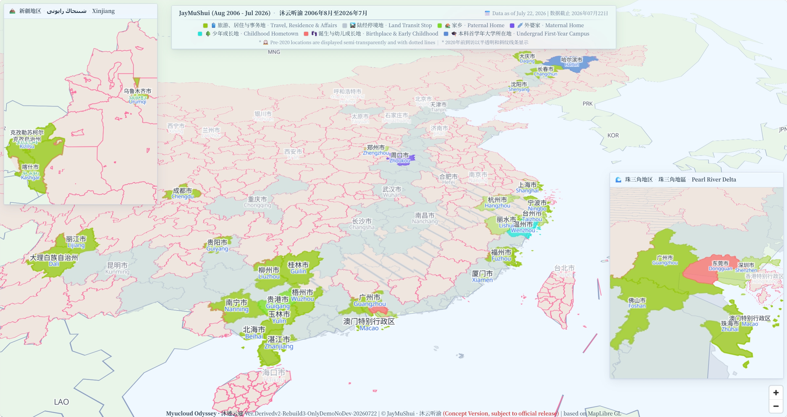
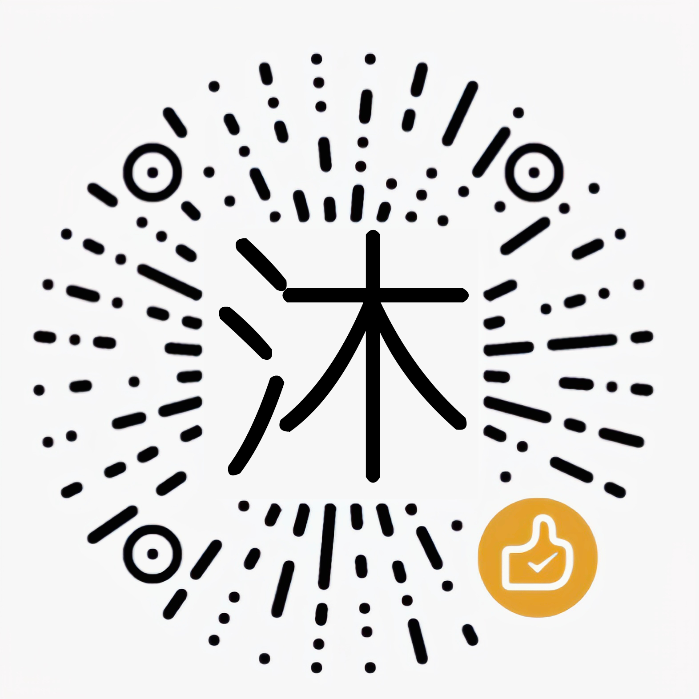

## Here is [JayMuShui | 沐云听渝 or 沐](https://jaymushui.github.io)


```markdown

- 世界は大きな宝石箱みたいなんだ

> 世界就像是个巨大的宝石箱
> The world is like a huge treasure chest

- 中には輝く宝石がいっぱい詰まってる

> 里面塞满了熠熠生辉的宝石
> Filled to the brim with shining gems.


- 🎮星空鉄道とシロの旅

> 星空列车与白的旅行
> Hoshizora Tetsudou to Shiro no Tabi
```
[](https://git.io/typing-svg)
---

## 📊 统计卡片 / Summary Cards


## 🗺️ 个人足迹展示与沐迹云途Demo效果 / Personal Travel Footprints & Myucloud Odyssey Demo

<div align="center">



</div>

### 📊 旅行数据统计 / Travel Statistics

自2006年8月22日至2026年7月22日，在中华人民共和国境内：  
From August 22, 2006, to July 22, 2026, within the People's Republic of China:

- 🏠 **旅游过、居住过与发生了其他事情因而我要到达的地方 / Cities Resided Where I Traveled, Lived, or Occurred Other Things I Need to Reach**: 35 城市 / 35 cities 
- 🚶 **作为匆匆过客而经过的城市 / Cities Passed Through as a Passing Guest**: 80个 / 80 cities  
- 🎯 **已达成 / Cities Reached**: 115 / 333个地级市行政单位 / prefecture-level cities
- (达成率 / Completion: **34.53%**)


### 📏 地理跨度 / Geographic Span

- 📍 **南北跨度 / North-South Span**: 4000km (≈2500 miles)
- 📍 **东西跨度 / East-West Span**: 5000km (≈3100 miles)  
- 📍 **最长跨度 / Maximum Span**: 6000km (≈3700 miles)

### 💭 感言 / Reflections

不论是为兴趣而编程、而学习、而生活、而出发，或可能是活着的意念，都愿它们成为我人生旅途中能够支撑着还能再走下去的执念与希望。  
Whether coding for passion, learning, living, or traveling for curiosity, or even just the will to live, may they become precious and shining chapters in my life's journey.

> **技术说明 / Technical Note**  
> 
> 沐迹云途正在经历第三次重构设计与思路优化，采用 [MapLibre GL](https://github.com/maplibre/maplibre-gl-js) 核心驱动。足迹点位之外，**火车与民航航线的路线绘制与行程统计效果已完成并接入本 Demo**；本章节仍作为设计案例的理想效果在 GitHub README 中展示，期待后续替换为正式版本。  
> Myucloud Odyssey is undergoing its third reconstruction with design and conceptual optimization, powered by [MapLibre GL](https://github.com/maplibre/maplibre-gl-js). Beyond footprint markers, **rail and airline route visualization and trip statistics are now complete and wired into this demo**. This section still showcases the ideal design concept in the GitHub README and is expected to be replaced with the official version in the future.
---


## 🎯 主学习和期望就业方向 - 前端与轻量全栈 / Primary Learning & Expected Career Direction - Frontend & Lightweight Full-Stack

[<code></code>](https://code.visualstudio.com/)
|
[<code></code>](https://www.typescriptlang.org/)
[<code></code>](https://developer.mozilla.org/en-US/docs/Web/JavaScript)
[<code></code>](https://www.python.org/)
|
[<code></code>](https://developer.mozilla.org/en-US/docs/Web/HTML)
[<code></code>](https://developer.mozilla.org/en-US/docs/Web/CSS)
[<code></code>](https://tailwindcss.com/)
|
[<code></code>](https://nodejs.org/)
[<code></code>](https://vuejs.org/)
[<code></code>](https://expressjs.com/)
|
[<code></code>](https://vitejs.dev/) 
|
[<code></code>](https://pnpm.io/)
|
[<code></code>](https://git-scm.com/)
---

## 🩷 Suki Waifu / Favorite Characters

<div align="center">

<table>
  <tr>
    <td align="center" width="150">
      
      <br/>
      <b>ヘルタ</b>
      <br/>
      黑塔
      <br/>
      <sub>Herta</sub>
    </td>
    <td align="center" width="150">
      
      <br/>
      <b>椎名真昼</b>
      <br/>
      椎名真昼
      <br/>
      <sub>Shiina Mahiru</sub>
    </td>
    <td align="center" width="150">
      
      <br/>
      <b>シロバナ</b>
      <br/>
      白花
      <br/>
      <sub>Shirobana</sub>
    </td>
    <td align="center" width="150">
      
      <br/>
      <b>風又ねり</b>
      <br/>
      风又音理
      <br/>
      <sub>Kazamata Neri</sub>
    </td>
    <td align="center" width="150">
      
      <br/>
      <b>阿慈谷ヒフミ</b>
      <br/>
      阿慈谷日富美
      <br/>
      <sub>Ajitani Hifumi</sub>
    </td>
  </tr>
</table>

</div>

>还有更多...相关喜爱角色的页面陈列暂未制作，敬请期待～ 

>There are more... The related pages are not yet created. Please stay tuned~


## 💰 支持与赞助 / Support & Sponsorship

<p align="center">
  
  
  
</p>

<p align="center">
  <b>支付宝 / Alipay</b>　　<b>微信 / WeChat</b>　　<b>QQ</b>
</p>


<p align="center">
  我很可爱，请给我钱～ / I'm kawaii, please give me money~
</p>

> 仅在Github上展示的内容不充分，需要了解我更多方面？😊 请前往我的[个人网站](https://jaymushui.github.io)查看更多信息～  
> The content displayed on Github is not comprehensive. Want to know more about me? 😊 Visit my [personal website](https://jaymushui.github.io) for more information~<p align="right">
     
</p>


###### 2026-07-22 in chaotic emotions.