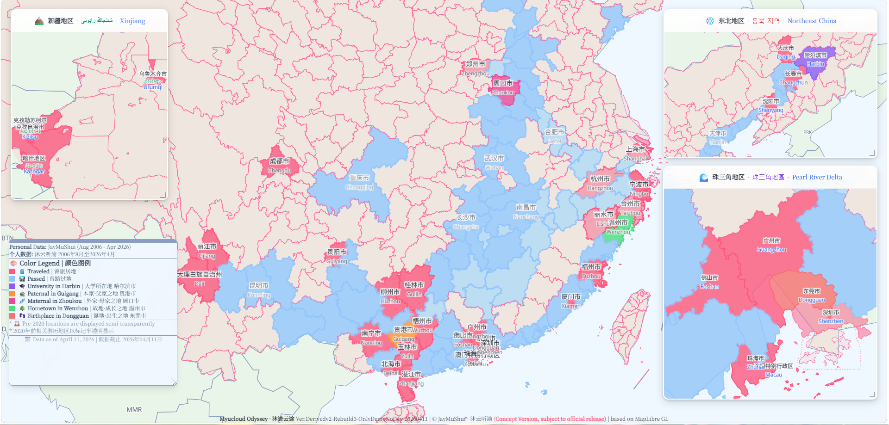

## Here is [JayMuShui | 沐云听渝 or 沐](https://jaymushui.github.io)


```markdown

- 世界は大きな宝石箱みたいなんだ

> 世界就像是个巨大的宝石箱
> The world is like a huge treasure chest

- 中には輝く宝石がいっぱい詰まってる

> 里面塞满了熠熠生辉的宝石
> Filled to the brim with shining gems.


- 🎮星空鉄道とシロの旅

> 星空列车与白的旅行
> Hoshizora Tetsudou to Shiro no Tabi
```
[](https://git.io/typing-svg)
---

## 📊 统计卡片 / Summary Cards


## 🗺️ 个人足迹展示与沐迹云途Demo效果 / Personal Travel Footprints & Myucloud Odyssey Demo

<div align="center">



</div>

### 📊 旅行数据统计 / Travel Statistics

自2006年8月22日至2026年4月11日，在中华人民共和国境内：  
From August 22, 2006, to April 11, 2026, within the People's Republic of China:

- 🏠 **旅居城市 / Cities Resided**: 35个（含出生地、老家、学校等具有特殊意义的地点）/ 35 cities (including birthplace, hometowns, schools, and other places of special significance)
- 🚶 **途经城市 / Cities Passed Through**: 79个 / 79 cities  
- 🎯 **已达成 / Cities Reached**: 114 / 333个地级市行政单位 / prefecture-level cities
- (达成率 / Completion: **34.23%**)

### 📏 地理跨度 / Geographic Span

- 📍 **南北跨度 / North-South Span**: 4000km (≈2500 miles)
- 📍 **东西跨度 / East-West Span**: 5000km (≈3100 miles)  
- 📍 **最长跨度 / Maximum Span**: 6000km (≈3700 miles)

### 💭 感言 / Reflections

庆幸自己拥有这样的出身，更庆幸家人能支持这般选择。  
Grateful for my origins and even more grateful that my family supports such choices.

不论是为兴趣而编程，还是为兴趣而出发，都愿它们成为我人生旅途中珍贵而闪耀的篇章。  
Whether coding for passion or traveling for curiosity, may they become precious and shining chapters in my life's journey.

> **技术说明 / Technical Note**  
> 
> 沐迹云途正在经历第三次重构设计与思路优化，采用 [MapLibre GL](https://github.com/maplibre/maplibre-gl-js) 核心驱动。本章节仅作为设计案例的理想效果在GitHub README中展示，期待后续替换为正式版本。  
> Myucloud Odyssey is undergoing its third reconstruction with design and conceptual optimization, powered by [MapLibre GL](https://github.com/maplibre/maplibre-gl-js). This section showcases the ideal design concept in the GitHub README and is expected to be replaced with the official version in the future.
>
> **自涉猎本专业以来，除了珍爱数字世界的一切事物，内心始终怀揣着一个愿望——通过自己的设计，将地理世界也收纳于掌上。于是沐迹云途这一企划应运而生，虽已推进半年有余，进度依旧缓慢，但我坚信终会实现。**  
> **Since delving into this field, beyond cherishing all things digital, I've harbored a constant dream — to encapsulate the geographical world in the palm of my hand through my own design. Thus, the Myucloud Odyssey project was born. Though it has been progressing for over half a year at a slow pace, I firmly believe it will eventually come to fruition.**
>
> **当然，未来出国的想法也在考虑之中，收集的GeoJSON素材中已包含海外地理数据，期待有朝一日能在世界地图上留下更多足迹。**  
> **Of course, the idea of traveling abroad is also under consideration. The collected GeoJSON materials already include overseas geographic data, and I look forward to leaving more footprints on the world map someday.**

---


## 🎯 主学习和期望就业方向 - 前端与轻量全栈 / Primary Learning & Expected Career Direction - Frontend & Lightweight Full-Stack

[<code></code>](https://code.visualstudio.com/)
[<code></code>](https://www.jetbrains.com/)
|
[<code></code>](https://www.typescriptlang.org/)
[<code></code>](https://developer.mozilla.org/en-US/docs/Web/JavaScript)
[<code></code>](https://www.python.org/)
[<code></code>](https://www.java.com/)
|
[<code></code>](https://developer.mozilla.org/en-US/docs/Web/HTML)
[<code></code>](https://developer.mozilla.org/en-US/docs/Web/CSS)
[<code></code>](https://tailwindcss.com/)
|
[<code></code>](https://nodejs.org/)
[<code></code>](https://vuejs.org/)
[<code></code>](https://expressjs.com/)
|
[<code></code>](https://vitejs.dev/) 
|
[<code></code>](https://www.mysql.com/)
|
[<code></code>](https://www.npmjs.com/)
[<code></code>](https://pnpm.io/)
|
[<code></code>](https://git-scm.com/)
---

## 💕 Love 

### 💝 弦舟 / Xianzhou


```markdown

Here is Mu,To You,Xianzhou:

- 私のこと、覚えていてほしい。こんなふうに生きていた、こんなふうにあなたのそばにいたことを。
> 「ノルウェーの森」 村上春树
- 希望你能记住我，记住我这样活过，这样在你身边呆过。
> 《挪威的森林》 （译由 林少华）
- I want you to keep me in your memory. Keep in mind that I existed like this, that I was with you like this.
>  Norwegian Wood （Translated by Philip Gabriel）
```


```markdown
Xianzhou,Your Reply to Me,Mu is Here: 

- 君のこと、ずっと覚えてる。こんなふうに生きていた、こんなふうに僕のそばに存在していたことを。
> 「心にあなたがいて、四季ずっとそばに」 → 弦舟(シェンジョウ)
- 我会记住你，记住你这样活过，这样在我身边存在着。
> <在我心上，伴我四季> → 弦舟
- I’ll keep you in my memory, keep in mind that you lived this way, that you existed right by my side like this.
> In My Heart You Stay, With Me Through Every Season → Xianzhou

```

### 🩷 Suki Waifu / Favorite Characters

<div align="center">

<table>
  <tr>
    <td align="center" width="150">
      
      <br/>
      <b>ヘルタ</b>
      <br/>
      黑塔
      <br/>
      <sub>Herta</sub>
    </td>
    <td align="center" width="150">
      
      <br/>
      <b>椎名真昼</b>
      <br/>
      椎名真昼
      <br/>
      <sub>Shiina Mahiru</sub>
    </td>
    <td align="center" width="150">
      
      <br/>
      <b>シロバナ</b>
      <br/>
      白花
      <br/>
      <sub>Shirobana</sub>
    </td>
    <td align="center" width="150">
      
      <br/>
      <b>風又ねり</b>
      <br/>
      风又音理
      <br/>
      <sub>Kazamata Neri</sub>
    </td>
    <td align="center" width="150">
      
      <br/>
      <b>阿慈谷ヒフミ</b>
      <br/>
      阿慈谷日富美
      <br/>
      <sub>Ajitani Hifumi</sub>
    </td>
  </tr>
</table>

</div>

>还有更多...相关喜爱角色的页面陈列暂未制作，敬请期待～ 

>There are more... The related pages are not yet created. Please stay tuned~


## 💰 支持与赞助 / Support & Sponsorship

<p align="center">
  
  
  
</p>

<p align="center">
  <b>支付宝 / Alipay</b>　　<b>微信 / WeChat</b>　　<b>QQ</b>
</p>


<p align="center">
  我是学生，请给我钱～ / I'm a student, please give me money~
</p>

> 仅在Github上展示的内容不充分，需要了解我更多方面？😊 请前往我的[个人网站](https://jaymushui.github.io)查看更多信息～  
> The content displayed on Github is not comprehensive. Want to know more about me? 😊 Visit my [personal website](https://jaymushui.github.io) for more information~<p align="right">
     
</p>


###### 2026-01-14